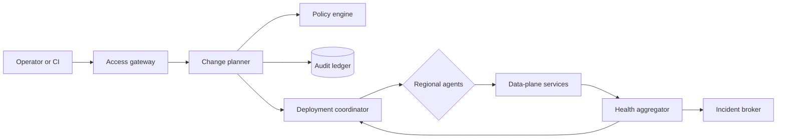

# Kiron Fleet Control Plane engineering handbook

> [!NOTE]
> This is an original, deterministic theme fixture. It models a realistic multi-tenant release control plane without containing production secrets or copied runbooks.

## 1. Mission and operating boundaries

Kiron Fleet coordinates progressive delivery across four regions. It evaluates tenant policy, creates immutable release plans, observes service-level indicators, pauses unsafe changes, and records every operator decision in the audit ledger.

The control plane never proxies customer traffic. Data-plane services continue serving the last accepted configuration when Kiron is unavailable. This separation keeps a control-plane incident from becoming an immediate request-path outage.

### Reliability objectives

| Capability | SLI | Target | Window | Paging threshold |
| --- | --- | ---: | --- | --- |
| Plan admission | valid decisions / requests | 99.99% | 30 days | two 5-minute windows below 99.5% |
| Audit delivery | events delivered under 60 s | 99.95% | 7 days | p99 over 5 minutes for 10 minutes |
| Flag propagation | acknowledgements under 30 s | 99.90% | 24 hours | any region below 98% for 5 minutes |
| Rollback initiation | guard to command latency | 99.99% under 10 s | 30 days | one command over 30 seconds |

## 2. Architecture



### 2.1 Request lifecycle

1. The caller submits a declarative change with an idempotency key.
2. The access gateway authenticates workload identity and resolves tenant scope.
3. The policy engine evaluates maintenance windows, segregation of duties, and blast-radius limits.
4. The planner freezes an immutable plan containing stages, checks, rollback actions, and evidence requirements.
5. The coordinator releases one stage at a time and waits for regional acknowledgements.
6. The health aggregator evaluates fast-burn and slow-burn SLO windows.
7. Any failed guard moves the plan to `paused`; critical guards also enqueue rollback.
8. The audit ledger links the request, policy decision, operator action, and observed outcome.

### 2.2 State machine

| Current state | Command | Guard | Next state | Side effect |
| --- | --- | --- | --- | --- |
| `draft` | submit | schema and ownership valid | `pending_approval` | write plan digest |
| `pending_approval` | approve | distinct authorized reviewer | `scheduled` | freeze stages |
| `scheduled` | start | window open and capacity available | `running` | dispatch stage zero |
| `running` | observe | all gates pass | `running` | advance exposure |
| `running` | observe | a gate fails | `paused` | page owner |
| `paused` | rollback | rollback token valid | `rolling_back` | dispatch prior revision |
| `rolling_back` | observe | prior revision healthy | `rolled_back` | close mitigation task |
| `running` | complete | final dwell elapsed | `completed` | seal evidence bundle |

## 3. API contract

### Create a release plan

```http
POST /v1/tenants/northwind/release-plans HTTP/1.1
Host: control.kiron.example
Authorization: Bearer <workload-token>
Content-Type: application/json
Idempotency-Key: release-2026-08-12-flag-evaluator

{
  "service": "flag-evaluator",
  "artifact": "sha256:6d8f...9a2c",
  "regions": ["ap-northeast-2", "ap-southeast-1"],
  "strategy": {
    "type": "progressive",
    "steps": [1, 5, 10, 25, 50, 100],
    "dwell_seconds": 900
  }
}
```

### Error envelope

```json
{
  "type": "https://control.kiron.example/problems/policy-denied",
  "title": "Release policy denied the request",
  "status": 403,
  "detail": "A production change requires an independent reviewer",
  "instance": "/v1/tenants/northwind/release-plans/rp_01J5...",
  "trace_id": "4c812f42aa864adca27be9eb9eb93c9e"
}
```

## 4. Release procedure

### Preflight checklist

- [ ] Artifact digest is immutable and present in the production registry.
- [ ] Database migrations are backward compatible with the active revision.
- [ ] Dashboards include revision, tenant, and region dimensions.
- [ ] Fast-burn and slow-burn alerts have valid links to this handbook.
- [ ] Rollback was exercised against the same artifact family in staging.
- [ ] The change owner and independent approver are on shift.
- [ ] Capacity headroom remains above 30% in every target region.
- [ ] No overlapping freeze or regional maintenance window is active.

### Operator commands

```bash
kiron auth whoami --format json
kiron plans validate ./release-plan.json --strict
kiron plans create --tenant northwind --file ./release-plan.json
kiron plans watch rp_01J5KIRON --until terminal --timeout 2h
kiron evidence export rp_01J5KIRON --output ./evidence.tar.zst
```

## 5. Incident command protocol

> [!WARNING]
> Do not restart the coordinator before confirming whether an active lease exists. A blind restart can create duplicate regional commands even though plan APIs are idempotent.

1. Declare the incident and assign incident commander, operations lead, and communications lead.
2. Freeze new production plans without cancelling in-flight rollback actions.
3. Record UTC timestamps and query boundaries before collecting evidence.
4. Prefer scoped traffic reduction over full regional evacuation.
5. Require two operators for manual audit repair or policy bypass.
6. Restore service, observe for one slow-burn window, then close mitigation.

## 6. Service runbooks

### 6.1 access-gateway in ap-northeast-2

- **Owner:** `identity`
- **Current revision:** `2026.08.120`
- **Desired replicas:** 3
- **p99 latency:** 42 ms
- **Remaining error budget:** 99.7%
- **Representative incident:** `INC-2026-08120`

#### Symptoms

Operators may see delayed acknowledgements from `ap-northeast-2`, a growing command queue, or a revision mismatch between the coordinator and access-gateway. A single late heartbeat is not sufficient evidence of an outage.

#### Triage query

```text
sum by (revision, result) (rate(kiron_access_gateway_requests_total{region="ap-northeast-2"}[5m]))
histogram_quantile(0.99, sum by (le) (rate(kiron_access_gateway_latency_seconds_bucket{region="ap-northeast-2"}[5m])))
```

#### Mitigation

1. Pause plans targeting `access-gateway` in `ap-northeast-2` while leaving other services untouched.
2. Compare the last accepted revision with `2026.08.120` and verify the artifact digest.
3. If the regional error rate remains above 2%, shift new commands to `ap-southeast-1` and retain read-only status polling.
4. If recovery fails after two probe intervals, roll back the active stage and attach `INC-2026-08120` to the evidence bundle.

#### Recovery validation

- [ ] access-gateway has reported the same revision for three consecutive heartbeats.
- [ ] The p99 latency in ap-northeast-2 is below 200 ms.
- [ ] No new policy denials or audit delivery gaps appeared during the observation window.
- [ ] The operator timeline contains the plan ID, trace ID, queries, and decision owner.

### 6.2 artifact-registry in ap-southeast-1

- **Owner:** `release-platform`
- **Current revision:** `2026.08.121`
- **Desired replicas:** 4
- **p99 latency:** 79 ms
- **Remaining error budget:** 98.3%
- **Representative incident:** `INC-2026-08121`

#### Symptoms

Operators may see delayed acknowledgements from `ap-southeast-1`, a growing command queue, or a revision mismatch between the coordinator and artifact-registry. A single late heartbeat is not sufficient evidence of an outage.

#### Triage query

```text
sum by (revision, result) (rate(kiron_artifact_registry_requests_total{region="ap-southeast-1"}[5m]))
histogram_quantile(0.99, sum by (le) (rate(kiron_artifact_registry_latency_seconds_bucket{region="ap-southeast-1"}[5m])))
```

#### Mitigation

1. Pause plans targeting `artifact-registry` in `ap-southeast-1` while leaving other services untouched.
2. Compare the last accepted revision with `2026.08.121` and verify the artifact digest.
3. If the regional error rate remains above 2%, shift new commands to `eu-central-1` and retain read-only status polling.
4. If recovery fails after two probe intervals, roll back the active stage and attach `INC-2026-08121` to the evidence bundle.

#### Recovery validation

- [ ] artifact-registry has reported the same revision for three consecutive heartbeats.
- [ ] The p99 latency in ap-southeast-1 is below 200 ms.
- [ ] No new policy denials or audit delivery gaps appeared during the observation window.
- [ ] The operator timeline contains the plan ID, trace ID, queries, and decision owner.

### 6.3 audit-ledger in eu-central-1

- **Owner:** `runtime-reliability`
- **Current revision:** `2026.08.122`
- **Desired replicas:** 5
- **p99 latency:** 116 ms
- **Remaining error budget:** 97.0%
- **Representative incident:** `INC-2026-08122`

#### Symptoms

Operators may see delayed acknowledgements from `eu-central-1`, a growing command queue, or a revision mismatch between the coordinator and audit-ledger. A single late heartbeat is not sufficient evidence of an outage.

#### Triage query

```text
sum by (revision, result) (rate(kiron_audit_ledger_requests_total{region="eu-central-1"}[5m]))
histogram_quantile(0.99, sum by (le) (rate(kiron_audit_ledger_latency_seconds_bucket{region="eu-central-1"}[5m])))
```

#### Mitigation

1. Pause plans targeting `audit-ledger` in `eu-central-1` while leaving other services untouched.
2. Compare the last accepted revision with `2026.08.122` and verify the artifact digest.
3. If the regional error rate remains above 2%, shift new commands to `us-east-1` and retain read-only status polling.
4. If recovery fails after two probe intervals, roll back the active stage and attach `INC-2026-08122` to the evidence bundle.

#### Recovery validation

- [ ] audit-ledger has reported the same revision for three consecutive heartbeats.
- [ ] The p99 latency in eu-central-1 is below 216 ms.
- [ ] No new policy denials or audit delivery gaps appeared during the observation window.
- [ ] The operator timeline contains the plan ID, trace ID, queries, and decision owner.

### 6.4 billing-meter in us-east-1

- **Owner:** `developer-experience`
- **Current revision:** `2026.08.123`
- **Desired replicas:** 6
- **p99 latency:** 153 ms
- **Remaining error budget:** 95.6%
- **Representative incident:** `INC-2026-08123`

#### Symptoms

Operators may see delayed acknowledgements from `us-east-1`, a growing command queue, or a revision mismatch between the coordinator and billing-meter. A single late heartbeat is not sufficient evidence of an outage.

#### Triage query

```text
sum by (revision, result) (rate(kiron_billing_meter_requests_total{region="us-east-1"}[5m]))
histogram_quantile(0.99, sum by (le) (rate(kiron_billing_meter_latency_seconds_bucket{region="us-east-1"}[5m])))
```

#### Mitigation

1. Pause plans targeting `billing-meter` in `us-east-1` while leaving other services untouched.
2. Compare the last accepted revision with `2026.08.123` and verify the artifact digest.
3. If the regional error rate remains above 2%, shift new commands to `ap-northeast-2` and retain read-only status polling.
4. If recovery fails after two probe intervals, roll back the active stage and attach `INC-2026-08123` to the evidence bundle.

#### Recovery validation

- [ ] billing-meter has reported the same revision for three consecutive heartbeats.
- [ ] The p99 latency in us-east-1 is below 253 ms.
- [ ] No new policy denials or audit delivery gaps appeared during the observation window.
- [ ] The operator timeline contains the plan ID, trace ID, queries, and decision owner.

### 6.5 change-planner in ap-northeast-2

- **Owner:** `security-engineering`
- **Current revision:** `2026.08.124`
- **Desired replicas:** 7
- **p99 latency:** 190 ms
- **Remaining error budget:** 94.2%
- **Representative incident:** `INC-2026-08124`

#### Symptoms

Operators may see delayed acknowledgements from `ap-northeast-2`, a growing command queue, or a revision mismatch between the coordinator and change-planner. A single late heartbeat is not sufficient evidence of an outage.

#### Triage query

```text
sum by (revision, result) (rate(kiron_change_planner_requests_total{region="ap-northeast-2"}[5m]))
histogram_quantile(0.99, sum by (le) (rate(kiron_change_planner_latency_seconds_bucket{region="ap-northeast-2"}[5m])))
```

#### Mitigation

1. Pause plans targeting `change-planner` in `ap-northeast-2` while leaving other services untouched.
2. Compare the last accepted revision with `2026.08.124` and verify the artifact digest.
3. If the regional error rate remains above 2%, shift new commands to `ap-southeast-1` and retain read-only status polling.
4. If recovery fails after two probe intervals, roll back the active stage and attach `INC-2026-08124` to the evidence bundle.

#### Recovery validation

- [ ] change-planner has reported the same revision for three consecutive heartbeats.
- [ ] The p99 latency in ap-northeast-2 is below 290 ms.
- [ ] No new policy denials or audit delivery gaps appeared during the observation window.
- [ ] The operator timeline contains the plan ID, trace ID, queries, and decision owner.

### 6.6 config-resolver in ap-southeast-1

- **Owner:** `data-foundation`
- **Current revision:** `2026.08.125`
- **Desired replicas:** 8
- **p99 latency:** 227 ms
- **Remaining error budget:** 92.9%
- **Representative incident:** `INC-2026-08125`

#### Symptoms

Operators may see delayed acknowledgements from `ap-southeast-1`, a growing command queue, or a revision mismatch between the coordinator and config-resolver. A single late heartbeat is not sufficient evidence of an outage.

#### Triage query

```text
sum by (revision, result) (rate(kiron_config_resolver_requests_total{region="ap-southeast-1"}[5m]))
histogram_quantile(0.99, sum by (le) (rate(kiron_config_resolver_latency_seconds_bucket{region="ap-southeast-1"}[5m])))
```

#### Mitigation

1. Pause plans targeting `config-resolver` in `ap-southeast-1` while leaving other services untouched.
2. Compare the last accepted revision with `2026.08.125` and verify the artifact digest.
3. If the regional error rate remains above 2%, shift new commands to `eu-central-1` and retain read-only status polling.
4. If recovery fails after two probe intervals, roll back the active stage and attach `INC-2026-08125` to the evidence bundle.

#### Recovery validation

- [ ] config-resolver has reported the same revision for three consecutive heartbeats.
- [ ] The p99 latency in ap-southeast-1 is below 327 ms.
- [ ] No new policy denials or audit delivery gaps appeared during the observation window.
- [ ] The operator timeline contains the plan ID, trace ID, queries, and decision owner.

### 6.7 deployment-coordinator in eu-central-1

- **Owner:** `identity`
- **Current revision:** `2026.08.126`
- **Desired replicas:** 3
- **p99 latency:** 264 ms
- **Remaining error budget:** 91.5%
- **Representative incident:** `INC-2026-08126`

#### Symptoms

Operators may see delayed acknowledgements from `eu-central-1`, a growing command queue, or a revision mismatch between the coordinator and deployment-coordinator. A single late heartbeat is not sufficient evidence of an outage.

#### Triage query

```text
sum by (revision, result) (rate(kiron_deployment_coordinator_requests_total{region="eu-central-1"}[5m]))
histogram_quantile(0.99, sum by (le) (rate(kiron_deployment_coordinator_latency_seconds_bucket{region="eu-central-1"}[5m])))
```

#### Mitigation

1. Pause plans targeting `deployment-coordinator` in `eu-central-1` while leaving other services untouched.
2. Compare the last accepted revision with `2026.08.126` and verify the artifact digest.
3. If the regional error rate remains above 2%, shift new commands to `us-east-1` and retain read-only status polling.
4. If recovery fails after two probe intervals, roll back the active stage and attach `INC-2026-08126` to the evidence bundle.

#### Recovery validation

- [ ] deployment-coordinator has reported the same revision for three consecutive heartbeats.
- [ ] The p99 latency in eu-central-1 is below 364 ms.
- [ ] No new policy denials or audit delivery gaps appeared during the observation window.
- [ ] The operator timeline contains the plan ID, trace ID, queries, and decision owner.

### 6.8 event-router in us-east-1

- **Owner:** `release-platform`
- **Current revision:** `2026.08.127`
- **Desired replicas:** 4
- **p99 latency:** 301 ms
- **Remaining error budget:** 90.1%
- **Representative incident:** `INC-2026-08127`

#### Symptoms

Operators may see delayed acknowledgements from `us-east-1`, a growing command queue, or a revision mismatch between the coordinator and event-router. A single late heartbeat is not sufficient evidence of an outage.

#### Triage query

```text
sum by (revision, result) (rate(kiron_event_router_requests_total{region="us-east-1"}[5m]))
histogram_quantile(0.99, sum by (le) (rate(kiron_event_router_latency_seconds_bucket{region="us-east-1"}[5m])))
```

#### Mitigation

1. Pause plans targeting `event-router` in `us-east-1` while leaving other services untouched.
2. Compare the last accepted revision with `2026.08.127` and verify the artifact digest.
3. If the regional error rate remains above 2%, shift new commands to `ap-northeast-2` and retain read-only status polling.
4. If recovery fails after two probe intervals, roll back the active stage and attach `INC-2026-08127` to the evidence bundle.

#### Recovery validation

- [ ] event-router has reported the same revision for three consecutive heartbeats.
- [ ] The p99 latency in us-east-1 is below 401 ms.
- [ ] No new policy denials or audit delivery gaps appeared during the observation window.
- [ ] The operator timeline contains the plan ID, trace ID, queries, and decision owner.

### 6.9 flag-evaluator in ap-northeast-2

- **Owner:** `runtime-reliability`
- **Current revision:** `2026.08.128`
- **Desired replicas:** 5
- **p99 latency:** 338 ms
- **Remaining error budget:** 88.7%
- **Representative incident:** `INC-2026-08128`

#### Symptoms

Operators may see delayed acknowledgements from `ap-northeast-2`, a growing command queue, or a revision mismatch between the coordinator and flag-evaluator. A single late heartbeat is not sufficient evidence of an outage.

#### Triage query

```text
sum by (revision, result) (rate(kiron_flag_evaluator_requests_total{region="ap-northeast-2"}[5m]))
histogram_quantile(0.99, sum by (le) (rate(kiron_flag_evaluator_latency_seconds_bucket{region="ap-northeast-2"}[5m])))
```

#### Mitigation

1. Pause plans targeting `flag-evaluator` in `ap-northeast-2` while leaving other services untouched.
2. Compare the last accepted revision with `2026.08.128` and verify the artifact digest.
3. If the regional error rate remains above 2%, shift new commands to `ap-southeast-1` and retain read-only status polling.
4. If recovery fails after two probe intervals, roll back the active stage and attach `INC-2026-08128` to the evidence bundle.

#### Recovery validation

- [ ] flag-evaluator has reported the same revision for three consecutive heartbeats.
- [ ] The p99 latency in ap-northeast-2 is below 438 ms.
- [ ] No new policy denials or audit delivery gaps appeared during the observation window.
- [ ] The operator timeline contains the plan ID, trace ID, queries, and decision owner.

### 6.10 health-aggregator in ap-southeast-1

- **Owner:** `developer-experience`
- **Current revision:** `2026.08.129`
- **Desired replicas:** 6
- **p99 latency:** 375 ms
- **Remaining error budget:** 87.4%
- **Representative incident:** `INC-2026-08129`

#### Symptoms

Operators may see delayed acknowledgements from `ap-southeast-1`, a growing command queue, or a revision mismatch between the coordinator and health-aggregator. A single late heartbeat is not sufficient evidence of an outage.

#### Triage query

```text
sum by (revision, result) (rate(kiron_health_aggregator_requests_total{region="ap-southeast-1"}[5m]))
histogram_quantile(0.99, sum by (le) (rate(kiron_health_aggregator_latency_seconds_bucket{region="ap-southeast-1"}[5m])))
```

#### Mitigation

1. Pause plans targeting `health-aggregator` in `ap-southeast-1` while leaving other services untouched.
2. Compare the last accepted revision with `2026.08.129` and verify the artifact digest.
3. If the regional error rate remains above 2%, shift new commands to `eu-central-1` and retain read-only status polling.
4. If recovery fails after two probe intervals, roll back the active stage and attach `INC-2026-08129` to the evidence bundle.

#### Recovery validation

- [ ] health-aggregator has reported the same revision for three consecutive heartbeats.
- [ ] The p99 latency in ap-southeast-1 is below 475 ms.
- [ ] No new policy denials or audit delivery gaps appeared during the observation window.
- [ ] The operator timeline contains the plan ID, trace ID, queries, and decision owner.

### 6.11 incident-broker in eu-central-1

- **Owner:** `security-engineering`
- **Current revision:** `2026.08.130`
- **Desired replicas:** 7
- **p99 latency:** 412 ms
- **Remaining error budget:** 86.0%
- **Representative incident:** `INC-2026-08130`

#### Symptoms

Operators may see delayed acknowledgements from `eu-central-1`, a growing command queue, or a revision mismatch between the coordinator and incident-broker. A single late heartbeat is not sufficient evidence of an outage.

#### Triage query

```text
sum by (revision, result) (rate(kiron_incident_broker_requests_total{region="eu-central-1"}[5m]))
histogram_quantile(0.99, sum by (le) (rate(kiron_incident_broker_latency_seconds_bucket{region="eu-central-1"}[5m])))
```

#### Mitigation

1. Pause plans targeting `incident-broker` in `eu-central-1` while leaving other services untouched.
2. Compare the last accepted revision with `2026.08.130` and verify the artifact digest.
3. If the regional error rate remains above 2%, shift new commands to `us-east-1` and retain read-only status polling.
4. If recovery fails after two probe intervals, roll back the active stage and attach `INC-2026-08130` to the evidence bundle.

#### Recovery validation

- [ ] incident-broker has reported the same revision for three consecutive heartbeats.
- [ ] The p99 latency in eu-central-1 is below 512 ms.
- [ ] No new policy denials or audit delivery gaps appeared during the observation window.
- [ ] The operator timeline contains the plan ID, trace ID, queries, and decision owner.

### 6.12 policy-engine in us-east-1

- **Owner:** `data-foundation`
- **Current revision:** `2026.08.131`
- **Desired replicas:** 8
- **p99 latency:** 449 ms
- **Remaining error budget:** 84.6%
- **Representative incident:** `INC-2026-08131`

#### Symptoms

Operators may see delayed acknowledgements from `us-east-1`, a growing command queue, or a revision mismatch between the coordinator and policy-engine. A single late heartbeat is not sufficient evidence of an outage.

#### Triage query

```text
sum by (revision, result) (rate(kiron_policy_engine_requests_total{region="us-east-1"}[5m]))
histogram_quantile(0.99, sum by (le) (rate(kiron_policy_engine_latency_seconds_bucket{region="us-east-1"}[5m])))
```

#### Mitigation

1. Pause plans targeting `policy-engine` in `us-east-1` while leaving other services untouched.
2. Compare the last accepted revision with `2026.08.131` and verify the artifact digest.
3. If the regional error rate remains above 2%, shift new commands to `ap-northeast-2` and retain read-only status polling.
4. If recovery fails after two probe intervals, roll back the active stage and attach `INC-2026-08131` to the evidence bundle.

#### Recovery validation

- [ ] policy-engine has reported the same revision for three consecutive heartbeats.
- [ ] The p99 latency in us-east-1 is below 549 ms.
- [ ] No new policy denials or audit delivery gaps appeared during the observation window.
- [ ] The operator timeline contains the plan ID, trace ID, queries, and decision owner.

### 6.13 access-gateway in ap-northeast-2

- **Owner:** `identity`
- **Current revision:** `2026.08.132`
- **Desired replicas:** 3
- **p99 latency:** 76 ms
- **Remaining error budget:** 83.3%
- **Representative incident:** `INC-2026-08132`

#### Symptoms

Operators may see delayed acknowledgements from `ap-northeast-2`, a growing command queue, or a revision mismatch between the coordinator and access-gateway. A single late heartbeat is not sufficient evidence of an outage.

#### Triage query

```text
sum by (revision, result) (rate(kiron_access_gateway_requests_total{region="ap-northeast-2"}[5m]))
histogram_quantile(0.99, sum by (le) (rate(kiron_access_gateway_latency_seconds_bucket{region="ap-northeast-2"}[5m])))
```

#### Mitigation

1. Pause plans targeting `access-gateway` in `ap-northeast-2` while leaving other services untouched.
2. Compare the last accepted revision with `2026.08.132` and verify the artifact digest.
3. If the regional error rate remains above 2%, shift new commands to `ap-southeast-1` and retain read-only status polling.
4. If recovery fails after two probe intervals, roll back the active stage and attach `INC-2026-08132` to the evidence bundle.

#### Recovery validation

- [ ] access-gateway has reported the same revision for three consecutive heartbeats.
- [ ] The p99 latency in ap-northeast-2 is below 200 ms.
- [ ] No new policy denials or audit delivery gaps appeared during the observation window.
- [ ] The operator timeline contains the plan ID, trace ID, queries, and decision owner.

### 6.14 artifact-registry in ap-southeast-1

- **Owner:** `release-platform`
- **Current revision:** `2026.08.133`
- **Desired replicas:** 4
- **p99 latency:** 113 ms
- **Remaining error budget:** 81.9%
- **Representative incident:** `INC-2026-08133`

#### Symptoms

Operators may see delayed acknowledgements from `ap-southeast-1`, a growing command queue, or a revision mismatch between the coordinator and artifact-registry. A single late heartbeat is not sufficient evidence of an outage.

#### Triage query

```text
sum by (revision, result) (rate(kiron_artifact_registry_requests_total{region="ap-southeast-1"}[5m]))
histogram_quantile(0.99, sum by (le) (rate(kiron_artifact_registry_latency_seconds_bucket{region="ap-southeast-1"}[5m])))
```

#### Mitigation

1. Pause plans targeting `artifact-registry` in `ap-southeast-1` while leaving other services untouched.
2. Compare the last accepted revision with `2026.08.133` and verify the artifact digest.
3. If the regional error rate remains above 2%, shift new commands to `eu-central-1` and retain read-only status polling.
4. If recovery fails after two probe intervals, roll back the active stage and attach `INC-2026-08133` to the evidence bundle.

#### Recovery validation

- [ ] artifact-registry has reported the same revision for three consecutive heartbeats.
- [ ] The p99 latency in ap-southeast-1 is below 213 ms.
- [ ] No new policy denials or audit delivery gaps appeared during the observation window.
- [ ] The operator timeline contains the plan ID, trace ID, queries, and decision owner.

### 6.15 audit-ledger in eu-central-1

- **Owner:** `runtime-reliability`
- **Current revision:** `2026.08.134`
- **Desired replicas:** 5
- **p99 latency:** 150 ms
- **Remaining error budget:** 80.5%
- **Representative incident:** `INC-2026-08134`

#### Symptoms

Operators may see delayed acknowledgements from `eu-central-1`, a growing command queue, or a revision mismatch between the coordinator and audit-ledger. A single late heartbeat is not sufficient evidence of an outage.

#### Triage query

```text
sum by (revision, result) (rate(kiron_audit_ledger_requests_total{region="eu-central-1"}[5m]))
histogram_quantile(0.99, sum by (le) (rate(kiron_audit_ledger_latency_seconds_bucket{region="eu-central-1"}[5m])))
```

#### Mitigation

1. Pause plans targeting `audit-ledger` in `eu-central-1` while leaving other services untouched.
2. Compare the last accepted revision with `2026.08.134` and verify the artifact digest.
3. If the regional error rate remains above 2%, shift new commands to `us-east-1` and retain read-only status polling.
4. If recovery fails after two probe intervals, roll back the active stage and attach `INC-2026-08134` to the evidence bundle.

#### Recovery validation

- [ ] audit-ledger has reported the same revision for three consecutive heartbeats.
- [ ] The p99 latency in eu-central-1 is below 250 ms.
- [ ] No new policy denials or audit delivery gaps appeared during the observation window.
- [ ] The operator timeline contains the plan ID, trace ID, queries, and decision owner.

### 6.16 billing-meter in us-east-1

- **Owner:** `developer-experience`
- **Current revision:** `2026.08.135`
- **Desired replicas:** 6
- **p99 latency:** 187 ms
- **Remaining error budget:** 79.2%
- **Representative incident:** `INC-2026-08135`

#### Symptoms

Operators may see delayed acknowledgements from `us-east-1`, a growing command queue, or a revision mismatch between the coordinator and billing-meter. A single late heartbeat is not sufficient evidence of an outage.

#### Triage query

```text
sum by (revision, result) (rate(kiron_billing_meter_requests_total{region="us-east-1"}[5m]))
histogram_quantile(0.99, sum by (le) (rate(kiron_billing_meter_latency_seconds_bucket{region="us-east-1"}[5m])))
```

#### Mitigation

1. Pause plans targeting `billing-meter` in `us-east-1` while leaving other services untouched.
2. Compare the last accepted revision with `2026.08.135` and verify the artifact digest.
3. If the regional error rate remains above 2%, shift new commands to `ap-northeast-2` and retain read-only status polling.
4. If recovery fails after two probe intervals, roll back the active stage and attach `INC-2026-08135` to the evidence bundle.

#### Recovery validation

- [ ] billing-meter has reported the same revision for three consecutive heartbeats.
- [ ] The p99 latency in us-east-1 is below 287 ms.
- [ ] No new policy denials or audit delivery gaps appeared during the observation window.
- [ ] The operator timeline contains the plan ID, trace ID, queries, and decision owner.

### 6.17 change-planner in ap-northeast-2

- **Owner:** `security-engineering`
- **Current revision:** `2026.08.136`
- **Desired replicas:** 7
- **p99 latency:** 224 ms
- **Remaining error budget:** 77.8%
- **Representative incident:** `INC-2026-08136`

#### Symptoms

Operators may see delayed acknowledgements from `ap-northeast-2`, a growing command queue, or a revision mismatch between the coordinator and change-planner. A single late heartbeat is not sufficient evidence of an outage.

#### Triage query

```text
sum by (revision, result) (rate(kiron_change_planner_requests_total{region="ap-northeast-2"}[5m]))
histogram_quantile(0.99, sum by (le) (rate(kiron_change_planner_latency_seconds_bucket{region="ap-northeast-2"}[5m])))
```

#### Mitigation

1. Pause plans targeting `change-planner` in `ap-northeast-2` while leaving other services untouched.
2. Compare the last accepted revision with `2026.08.136` and verify the artifact digest.
3. If the regional error rate remains above 2%, shift new commands to `ap-southeast-1` and retain read-only status polling.
4. If recovery fails after two probe intervals, roll back the active stage and attach `INC-2026-08136` to the evidence bundle.

#### Recovery validation

- [ ] change-planner has reported the same revision for three consecutive heartbeats.
- [ ] The p99 latency in ap-northeast-2 is below 324 ms.
- [ ] No new policy denials or audit delivery gaps appeared during the observation window.
- [ ] The operator timeline contains the plan ID, trace ID, queries, and decision owner.

### 6.18 config-resolver in ap-southeast-1

- **Owner:** `data-foundation`
- **Current revision:** `2026.08.137`
- **Desired replicas:** 8
- **p99 latency:** 261 ms
- **Remaining error budget:** 76.4%
- **Representative incident:** `INC-2026-08137`

#### Symptoms

Operators may see delayed acknowledgements from `ap-southeast-1`, a growing command queue, or a revision mismatch between the coordinator and config-resolver. A single late heartbeat is not sufficient evidence of an outage.

#### Triage query

```text
sum by (revision, result) (rate(kiron_config_resolver_requests_total{region="ap-southeast-1"}[5m]))
histogram_quantile(0.99, sum by (le) (rate(kiron_config_resolver_latency_seconds_bucket{region="ap-southeast-1"}[5m])))
```

#### Mitigation

1. Pause plans targeting `config-resolver` in `ap-southeast-1` while leaving other services untouched.
2. Compare the last accepted revision with `2026.08.137` and verify the artifact digest.
3. If the regional error rate remains above 2%, shift new commands to `eu-central-1` and retain read-only status polling.
4. If recovery fails after two probe intervals, roll back the active stage and attach `INC-2026-08137` to the evidence bundle.

#### Recovery validation

- [ ] config-resolver has reported the same revision for three consecutive heartbeats.
- [ ] The p99 latency in ap-southeast-1 is below 361 ms.
- [ ] No new policy denials or audit delivery gaps appeared during the observation window.
- [ ] The operator timeline contains the plan ID, trace ID, queries, and decision owner.

### 6.19 deployment-coordinator in eu-central-1

- **Owner:** `identity`
- **Current revision:** `2026.08.138`
- **Desired replicas:** 3
- **p99 latency:** 298 ms
- **Remaining error budget:** 75.0%
- **Representative incident:** `INC-2026-08138`

#### Symptoms

Operators may see delayed acknowledgements from `eu-central-1`, a growing command queue, or a revision mismatch between the coordinator and deployment-coordinator. A single late heartbeat is not sufficient evidence of an outage.

#### Triage query

```text
sum by (revision, result) (rate(kiron_deployment_coordinator_requests_total{region="eu-central-1"}[5m]))
histogram_quantile(0.99, sum by (le) (rate(kiron_deployment_coordinator_latency_seconds_bucket{region="eu-central-1"}[5m])))
```

#### Mitigation

1. Pause plans targeting `deployment-coordinator` in `eu-central-1` while leaving other services untouched.
2. Compare the last accepted revision with `2026.08.138` and verify the artifact digest.
3. If the regional error rate remains above 2%, shift new commands to `us-east-1` and retain read-only status polling.
4. If recovery fails after two probe intervals, roll back the active stage and attach `INC-2026-08138` to the evidence bundle.

#### Recovery validation

- [ ] deployment-coordinator has reported the same revision for three consecutive heartbeats.
- [ ] The p99 latency in eu-central-1 is below 398 ms.
- [ ] No new policy denials or audit delivery gaps appeared during the observation window.
- [ ] The operator timeline contains the plan ID, trace ID, queries, and decision owner.

### 6.20 event-router in us-east-1

- **Owner:** `release-platform`
- **Current revision:** `2026.08.139`
- **Desired replicas:** 4
- **p99 latency:** 335 ms
- **Remaining error budget:** 73.7%
- **Representative incident:** `INC-2026-08139`

#### Symptoms

Operators may see delayed acknowledgements from `us-east-1`, a growing command queue, or a revision mismatch between the coordinator and event-router. A single late heartbeat is not sufficient evidence of an outage.

#### Triage query

```text
sum by (revision, result) (rate(kiron_event_router_requests_total{region="us-east-1"}[5m]))
histogram_quantile(0.99, sum by (le) (rate(kiron_event_router_latency_seconds_bucket{region="us-east-1"}[5m])))
```

#### Mitigation

1. Pause plans targeting `event-router` in `us-east-1` while leaving other services untouched.
2. Compare the last accepted revision with `2026.08.139` and verify the artifact digest.
3. If the regional error rate remains above 2%, shift new commands to `ap-northeast-2` and retain read-only status polling.
4. If recovery fails after two probe intervals, roll back the active stage and attach `INC-2026-08139` to the evidence bundle.

#### Recovery validation

- [ ] event-router has reported the same revision for three consecutive heartbeats.
- [ ] The p99 latency in us-east-1 is below 435 ms.
- [ ] No new policy denials or audit delivery gaps appeared during the observation window.
- [ ] The operator timeline contains the plan ID, trace ID, queries, and decision owner.

### 6.21 flag-evaluator in ap-northeast-2

- **Owner:** `runtime-reliability`
- **Current revision:** `2026.08.140`
- **Desired replicas:** 5
- **p99 latency:** 372 ms
- **Remaining error budget:** 72.3%
- **Representative incident:** `INC-2026-08140`

#### Symptoms

Operators may see delayed acknowledgements from `ap-northeast-2`, a growing command queue, or a revision mismatch between the coordinator and flag-evaluator. A single late heartbeat is not sufficient evidence of an outage.

#### Triage query

```text
sum by (revision, result) (rate(kiron_flag_evaluator_requests_total{region="ap-northeast-2"}[5m]))
histogram_quantile(0.99, sum by (le) (rate(kiron_flag_evaluator_latency_seconds_bucket{region="ap-northeast-2"}[5m])))
```

#### Mitigation

1. Pause plans targeting `flag-evaluator` in `ap-northeast-2` while leaving other services untouched.
2. Compare the last accepted revision with `2026.08.140` and verify the artifact digest.
3. If the regional error rate remains above 2%, shift new commands to `ap-southeast-1` and retain read-only status polling.
4. If recovery fails after two probe intervals, roll back the active stage and attach `INC-2026-08140` to the evidence bundle.

#### Recovery validation

- [ ] flag-evaluator has reported the same revision for three consecutive heartbeats.
- [ ] The p99 latency in ap-northeast-2 is below 472 ms.
- [ ] No new policy denials or audit delivery gaps appeared during the observation window.
- [ ] The operator timeline contains the plan ID, trace ID, queries, and decision owner.

### 6.22 health-aggregator in ap-southeast-1

- **Owner:** `developer-experience`
- **Current revision:** `2026.08.141`
- **Desired replicas:** 6
- **p99 latency:** 409 ms
- **Remaining error budget:** 70.9%
- **Representative incident:** `INC-2026-08141`

#### Symptoms

Operators may see delayed acknowledgements from `ap-southeast-1`, a growing command queue, or a revision mismatch between the coordinator and health-aggregator. A single late heartbeat is not sufficient evidence of an outage.

#### Triage query

```text
sum by (revision, result) (rate(kiron_health_aggregator_requests_total{region="ap-southeast-1"}[5m]))
histogram_quantile(0.99, sum by (le) (rate(kiron_health_aggregator_latency_seconds_bucket{region="ap-southeast-1"}[5m])))
```

#### Mitigation

1. Pause plans targeting `health-aggregator` in `ap-southeast-1` while leaving other services untouched.
2. Compare the last accepted revision with `2026.08.141` and verify the artifact digest.
3. If the regional error rate remains above 2%, shift new commands to `eu-central-1` and retain read-only status polling.
4. If recovery fails after two probe intervals, roll back the active stage and attach `INC-2026-08141` to the evidence bundle.

#### Recovery validation

- [ ] health-aggregator has reported the same revision for three consecutive heartbeats.
- [ ] The p99 latency in ap-southeast-1 is below 509 ms.
- [ ] No new policy denials or audit delivery gaps appeared during the observation window.
- [ ] The operator timeline contains the plan ID, trace ID, queries, and decision owner.

### 6.23 incident-broker in eu-central-1

- **Owner:** `security-engineering`
- **Current revision:** `2026.08.142`
- **Desired replicas:** 7
- **p99 latency:** 446 ms
- **Remaining error budget:** 69.6%
- **Representative incident:** `INC-2026-08142`

#### Symptoms

Operators may see delayed acknowledgements from `eu-central-1`, a growing command queue, or a revision mismatch between the coordinator and incident-broker. A single late heartbeat is not sufficient evidence of an outage.

#### Triage query

```text
sum by (revision, result) (rate(kiron_incident_broker_requests_total{region="eu-central-1"}[5m]))
histogram_quantile(0.99, sum by (le) (rate(kiron_incident_broker_latency_seconds_bucket{region="eu-central-1"}[5m])))
```

#### Mitigation

1. Pause plans targeting `incident-broker` in `eu-central-1` while leaving other services untouched.
2. Compare the last accepted revision with `2026.08.142` and verify the artifact digest.
3. If the regional error rate remains above 2%, shift new commands to `us-east-1` and retain read-only status polling.
4. If recovery fails after two probe intervals, roll back the active stage and attach `INC-2026-08142` to the evidence bundle.

#### Recovery validation

- [ ] incident-broker has reported the same revision for three consecutive heartbeats.
- [ ] The p99 latency in eu-central-1 is below 546 ms.
- [ ] No new policy denials or audit delivery gaps appeared during the observation window.
- [ ] The operator timeline contains the plan ID, trace ID, queries, and decision owner.

### 6.24 policy-engine in us-east-1

- **Owner:** `data-foundation`
- **Current revision:** `2026.08.143`
- **Desired replicas:** 8
- **p99 latency:** 73 ms
- **Remaining error budget:** 68.2%
- **Representative incident:** `INC-2026-08143`

#### Symptoms

Operators may see delayed acknowledgements from `us-east-1`, a growing command queue, or a revision mismatch between the coordinator and policy-engine. A single late heartbeat is not sufficient evidence of an outage.

#### Triage query

```text
sum by (revision, result) (rate(kiron_policy_engine_requests_total{region="us-east-1"}[5m]))
histogram_quantile(0.99, sum by (le) (rate(kiron_policy_engine_latency_seconds_bucket{region="us-east-1"}[5m])))
```

#### Mitigation

1. Pause plans targeting `policy-engine` in `us-east-1` while leaving other services untouched.
2. Compare the last accepted revision with `2026.08.143` and verify the artifact digest.
3. If the regional error rate remains above 2%, shift new commands to `ap-northeast-2` and retain read-only status polling.
4. If recovery fails after two probe intervals, roll back the active stage and attach `INC-2026-08143` to the evidence bundle.

#### Recovery validation

- [ ] policy-engine has reported the same revision for three consecutive heartbeats.
- [ ] The p99 latency in us-east-1 is below 200 ms.
- [ ] No new policy denials or audit delivery gaps appeared during the observation window.
- [ ] The operator timeline contains the plan ID, trace ID, queries, and decision owner.

### 6.25 access-gateway in ap-northeast-2

- **Owner:** `identity`
- **Current revision:** `2026.08.144`
- **Desired replicas:** 3
- **p99 latency:** 110 ms
- **Remaining error budget:** 66.8%
- **Representative incident:** `INC-2026-08120`

#### Symptoms

Operators may see delayed acknowledgements from `ap-northeast-2`, a growing command queue, or a revision mismatch between the coordinator and access-gateway. A single late heartbeat is not sufficient evidence of an outage.

#### Triage query

```text
sum by (revision, result) (rate(kiron_access_gateway_requests_total{region="ap-northeast-2"}[5m]))
histogram_quantile(0.99, sum by (le) (rate(kiron_access_gateway_latency_seconds_bucket{region="ap-northeast-2"}[5m])))
```

#### Mitigation

1. Pause plans targeting `access-gateway` in `ap-northeast-2` while leaving other services untouched.
2. Compare the last accepted revision with `2026.08.144` and verify the artifact digest.
3. If the regional error rate remains above 2%, shift new commands to `ap-southeast-1` and retain read-only status polling.
4. If recovery fails after two probe intervals, roll back the active stage and attach `INC-2026-08120` to the evidence bundle.

#### Recovery validation

- [ ] access-gateway has reported the same revision for three consecutive heartbeats.
- [ ] The p99 latency in ap-northeast-2 is below 210 ms.
- [ ] No new policy denials or audit delivery gaps appeared during the observation window.
- [ ] The operator timeline contains the plan ID, trace ID, queries, and decision owner.

### 6.26 artifact-registry in ap-southeast-1

- **Owner:** `release-platform`
- **Current revision:** `2026.08.145`
- **Desired replicas:** 4
- **p99 latency:** 147 ms
- **Remaining error budget:** 65.5%
- **Representative incident:** `INC-2026-08121`

#### Symptoms

Operators may see delayed acknowledgements from `ap-southeast-1`, a growing command queue, or a revision mismatch between the coordinator and artifact-registry. A single late heartbeat is not sufficient evidence of an outage.

#### Triage query

```text
sum by (revision, result) (rate(kiron_artifact_registry_requests_total{region="ap-southeast-1"}[5m]))
histogram_quantile(0.99, sum by (le) (rate(kiron_artifact_registry_latency_seconds_bucket{region="ap-southeast-1"}[5m])))
```

#### Mitigation

1. Pause plans targeting `artifact-registry` in `ap-southeast-1` while leaving other services untouched.
2. Compare the last accepted revision with `2026.08.145` and verify the artifact digest.
3. If the regional error rate remains above 2%, shift new commands to `eu-central-1` and retain read-only status polling.
4. If recovery fails after two probe intervals, roll back the active stage and attach `INC-2026-08121` to the evidence bundle.

#### Recovery validation

- [ ] artifact-registry has reported the same revision for three consecutive heartbeats.
- [ ] The p99 latency in ap-southeast-1 is below 247 ms.
- [ ] No new policy denials or audit delivery gaps appeared during the observation window.
- [ ] The operator timeline contains the plan ID, trace ID, queries, and decision owner.

### 6.27 audit-ledger in eu-central-1

- **Owner:** `runtime-reliability`
- **Current revision:** `2026.08.146`
- **Desired replicas:** 5
- **p99 latency:** 184 ms
- **Remaining error budget:** 64.1%
- **Representative incident:** `INC-2026-08122`

#### Symptoms

Operators may see delayed acknowledgements from `eu-central-1`, a growing command queue, or a revision mismatch between the coordinator and audit-ledger. A single late heartbeat is not sufficient evidence of an outage.

#### Triage query

```text
sum by (revision, result) (rate(kiron_audit_ledger_requests_total{region="eu-central-1"}[5m]))
histogram_quantile(0.99, sum by (le) (rate(kiron_audit_ledger_latency_seconds_bucket{region="eu-central-1"}[5m])))
```

#### Mitigation

1. Pause plans targeting `audit-ledger` in `eu-central-1` while leaving other services untouched.
2. Compare the last accepted revision with `2026.08.146` and verify the artifact digest.
3. If the regional error rate remains above 2%, shift new commands to `us-east-1` and retain read-only status polling.
4. If recovery fails after two probe intervals, roll back the active stage and attach `INC-2026-08122` to the evidence bundle.

#### Recovery validation

- [ ] audit-ledger has reported the same revision for three consecutive heartbeats.
- [ ] The p99 latency in eu-central-1 is below 284 ms.
- [ ] No new policy denials or audit delivery gaps appeared during the observation window.
- [ ] The operator timeline contains the plan ID, trace ID, queries, and decision owner.

### 6.28 billing-meter in us-east-1

- **Owner:** `developer-experience`
- **Current revision:** `2026.08.147`
- **Desired replicas:** 6
- **p99 latency:** 221 ms
- **Remaining error budget:** 62.7%
- **Representative incident:** `INC-2026-08123`

#### Symptoms

Operators may see delayed acknowledgements from `us-east-1`, a growing command queue, or a revision mismatch between the coordinator and billing-meter. A single late heartbeat is not sufficient evidence of an outage.

#### Triage query

```text
sum by (revision, result) (rate(kiron_billing_meter_requests_total{region="us-east-1"}[5m]))
histogram_quantile(0.99, sum by (le) (rate(kiron_billing_meter_latency_seconds_bucket{region="us-east-1"}[5m])))
```

#### Mitigation

1. Pause plans targeting `billing-meter` in `us-east-1` while leaving other services untouched.
2. Compare the last accepted revision with `2026.08.147` and verify the artifact digest.
3. If the regional error rate remains above 2%, shift new commands to `ap-northeast-2` and retain read-only status polling.
4. If recovery fails after two probe intervals, roll back the active stage and attach `INC-2026-08123` to the evidence bundle.

#### Recovery validation

- [ ] billing-meter has reported the same revision for three consecutive heartbeats.
- [ ] The p99 latency in us-east-1 is below 321 ms.
- [ ] No new policy denials or audit delivery gaps appeared during the observation window.
- [ ] The operator timeline contains the plan ID, trace ID, queries, and decision owner.

### 6.29 change-planner in ap-northeast-2

- **Owner:** `security-engineering`
- **Current revision:** `2026.08.148`
- **Desired replicas:** 7
- **p99 latency:** 258 ms
- **Remaining error budget:** 61.3%
- **Representative incident:** `INC-2026-08124`

#### Symptoms

Operators may see delayed acknowledgements from `ap-northeast-2`, a growing command queue, or a revision mismatch between the coordinator and change-planner. A single late heartbeat is not sufficient evidence of an outage.

#### Triage query

```text
sum by (revision, result) (rate(kiron_change_planner_requests_total{region="ap-northeast-2"}[5m]))
histogram_quantile(0.99, sum by (le) (rate(kiron_change_planner_latency_seconds_bucket{region="ap-northeast-2"}[5m])))
```

#### Mitigation

1. Pause plans targeting `change-planner` in `ap-northeast-2` while leaving other services untouched.
2. Compare the last accepted revision with `2026.08.148` and verify the artifact digest.
3. If the regional error rate remains above 2%, shift new commands to `ap-southeast-1` and retain read-only status polling.
4. If recovery fails after two probe intervals, roll back the active stage and attach `INC-2026-08124` to the evidence bundle.

#### Recovery validation

- [ ] change-planner has reported the same revision for three consecutive heartbeats.
- [ ] The p99 latency in ap-northeast-2 is below 358 ms.
- [ ] No new policy denials or audit delivery gaps appeared during the observation window.
- [ ] The operator timeline contains the plan ID, trace ID, queries, and decision owner.

### 6.30 config-resolver in ap-southeast-1

- **Owner:** `data-foundation`
- **Current revision:** `2026.08.149`
- **Desired replicas:** 8
- **p99 latency:** 295 ms
- **Remaining error budget:** 60.0%
- **Representative incident:** `INC-2026-08125`

#### Symptoms

Operators may see delayed acknowledgements from `ap-southeast-1`, a growing command queue, or a revision mismatch between the coordinator and config-resolver. A single late heartbeat is not sufficient evidence of an outage.

#### Triage query

```text
sum by (revision, result) (rate(kiron_config_resolver_requests_total{region="ap-southeast-1"}[5m]))
histogram_quantile(0.99, sum by (le) (rate(kiron_config_resolver_latency_seconds_bucket{region="ap-southeast-1"}[5m])))
```

#### Mitigation

1. Pause plans targeting `config-resolver` in `ap-southeast-1` while leaving other services untouched.
2. Compare the last accepted revision with `2026.08.149` and verify the artifact digest.
3. If the regional error rate remains above 2%, shift new commands to `eu-central-1` and retain read-only status polling.
4. If recovery fails after two probe intervals, roll back the active stage and attach `INC-2026-08125` to the evidence bundle.

#### Recovery validation

- [ ] config-resolver has reported the same revision for three consecutive heartbeats.
- [ ] The p99 latency in ap-southeast-1 is below 395 ms.
- [ ] No new policy denials or audit delivery gaps appeared during the observation window.
- [ ] The operator timeline contains the plan ID, trace ID, queries, and decision owner.

### 6.31 deployment-coordinator in eu-central-1

- **Owner:** `identity`
- **Current revision:** `2026.08.150`
- **Desired replicas:** 3
- **p99 latency:** 332 ms
- **Remaining error budget:** 58.6%
- **Representative incident:** `INC-2026-08126`

#### Symptoms

Operators may see delayed acknowledgements from `eu-central-1`, a growing command queue, or a revision mismatch between the coordinator and deployment-coordinator. A single late heartbeat is not sufficient evidence of an outage.

#### Triage query

```text
sum by (revision, result) (rate(kiron_deployment_coordinator_requests_total{region="eu-central-1"}[5m]))
histogram_quantile(0.99, sum by (le) (rate(kiron_deployment_coordinator_latency_seconds_bucket{region="eu-central-1"}[5m])))
```

#### Mitigation

1. Pause plans targeting `deployment-coordinator` in `eu-central-1` while leaving other services untouched.
2. Compare the last accepted revision with `2026.08.150` and verify the artifact digest.
3. If the regional error rate remains above 2%, shift new commands to `us-east-1` and retain read-only status polling.
4. If recovery fails after two probe intervals, roll back the active stage and attach `INC-2026-08126` to the evidence bundle.

#### Recovery validation

- [ ] deployment-coordinator has reported the same revision for three consecutive heartbeats.
- [ ] The p99 latency in eu-central-1 is below 432 ms.
- [ ] No new policy denials or audit delivery gaps appeared during the observation window.
- [ ] The operator timeline contains the plan ID, trace ID, queries, and decision owner.

### 6.32 event-router in us-east-1

- **Owner:** `release-platform`
- **Current revision:** `2026.08.151`
- **Desired replicas:** 4
- **p99 latency:** 369 ms
- **Remaining error budget:** 57.2%
- **Representative incident:** `INC-2026-08127`

#### Symptoms

Operators may see delayed acknowledgements from `us-east-1`, a growing command queue, or a revision mismatch between the coordinator and event-router. A single late heartbeat is not sufficient evidence of an outage.

#### Triage query

```text
sum by (revision, result) (rate(kiron_event_router_requests_total{region="us-east-1"}[5m]))
histogram_quantile(0.99, sum by (le) (rate(kiron_event_router_latency_seconds_bucket{region="us-east-1"}[5m])))
```

#### Mitigation

1. Pause plans targeting `event-router` in `us-east-1` while leaving other services untouched.
2. Compare the last accepted revision with `2026.08.151` and verify the artifact digest.
3. If the regional error rate remains above 2%, shift new commands to `ap-northeast-2` and retain read-only status polling.
4. If recovery fails after two probe intervals, roll back the active stage and attach `INC-2026-08127` to the evidence bundle.

#### Recovery validation

- [ ] event-router has reported the same revision for three consecutive heartbeats.
- [ ] The p99 latency in us-east-1 is below 469 ms.
- [ ] No new policy denials or audit delivery gaps appeared during the observation window.
- [ ] The operator timeline contains the plan ID, trace ID, queries, and decision owner.

### 6.33 flag-evaluator in ap-northeast-2

- **Owner:** `runtime-reliability`
- **Current revision:** `2026.08.152`
- **Desired replicas:** 5
- **p99 latency:** 406 ms
- **Remaining error budget:** 55.9%
- **Representative incident:** `INC-2026-08128`

#### Symptoms

Operators may see delayed acknowledgements from `ap-northeast-2`, a growing command queue, or a revision mismatch between the coordinator and flag-evaluator. A single late heartbeat is not sufficient evidence of an outage.

#### Triage query

```text
sum by (revision, result) (rate(kiron_flag_evaluator_requests_total{region="ap-northeast-2"}[5m]))
histogram_quantile(0.99, sum by (le) (rate(kiron_flag_evaluator_latency_seconds_bucket{region="ap-northeast-2"}[5m])))
```

#### Mitigation

1. Pause plans targeting `flag-evaluator` in `ap-northeast-2` while leaving other services untouched.
2. Compare the last accepted revision with `2026.08.152` and verify the artifact digest.
3. If the regional error rate remains above 2%, shift new commands to `ap-southeast-1` and retain read-only status polling.
4. If recovery fails after two probe intervals, roll back the active stage and attach `INC-2026-08128` to the evidence bundle.

#### Recovery validation

- [ ] flag-evaluator has reported the same revision for three consecutive heartbeats.
- [ ] The p99 latency in ap-northeast-2 is below 506 ms.
- [ ] No new policy denials or audit delivery gaps appeared during the observation window.
- [ ] The operator timeline contains the plan ID, trace ID, queries, and decision owner.

### 6.34 health-aggregator in ap-southeast-1

- **Owner:** `developer-experience`
- **Current revision:** `2026.08.153`
- **Desired replicas:** 6
- **p99 latency:** 443 ms
- **Remaining error budget:** 54.5%
- **Representative incident:** `INC-2026-08129`

#### Symptoms

Operators may see delayed acknowledgements from `ap-southeast-1`, a growing command queue, or a revision mismatch between the coordinator and health-aggregator. A single late heartbeat is not sufficient evidence of an outage.

#### Triage query

```text
sum by (revision, result) (rate(kiron_health_aggregator_requests_total{region="ap-southeast-1"}[5m]))
histogram_quantile(0.99, sum by (le) (rate(kiron_health_aggregator_latency_seconds_bucket{region="ap-southeast-1"}[5m])))
```

#### Mitigation

1. Pause plans targeting `health-aggregator` in `ap-southeast-1` while leaving other services untouched.
2. Compare the last accepted revision with `2026.08.153` and verify the artifact digest.
3. If the regional error rate remains above 2%, shift new commands to `eu-central-1` and retain read-only status polling.
4. If recovery fails after two probe intervals, roll back the active stage and attach `INC-2026-08129` to the evidence bundle.

#### Recovery validation

- [ ] health-aggregator has reported the same revision for three consecutive heartbeats.
- [ ] The p99 latency in ap-southeast-1 is below 543 ms.
- [ ] No new policy denials or audit delivery gaps appeared during the observation window.
- [ ] The operator timeline contains the plan ID, trace ID, queries, and decision owner.

### 6.35 incident-broker in eu-central-1

- **Owner:** `security-engineering`
- **Current revision:** `2026.08.154`
- **Desired replicas:** 7
- **p99 latency:** 70 ms
- **Remaining error budget:** 53.1%
- **Representative incident:** `INC-2026-08130`

#### Symptoms

Operators may see delayed acknowledgements from `eu-central-1`, a growing command queue, or a revision mismatch between the coordinator and incident-broker. A single late heartbeat is not sufficient evidence of an outage.

#### Triage query

```text
sum by (revision, result) (rate(kiron_incident_broker_requests_total{region="eu-central-1"}[5m]))
histogram_quantile(0.99, sum by (le) (rate(kiron_incident_broker_latency_seconds_bucket{region="eu-central-1"}[5m])))
```

#### Mitigation

1. Pause plans targeting `incident-broker` in `eu-central-1` while leaving other services untouched.
2. Compare the last accepted revision with `2026.08.154` and verify the artifact digest.
3. If the regional error rate remains above 2%, shift new commands to `us-east-1` and retain read-only status polling.
4. If recovery fails after two probe intervals, roll back the active stage and attach `INC-2026-08130` to the evidence bundle.

#### Recovery validation

- [ ] incident-broker has reported the same revision for three consecutive heartbeats.
- [ ] The p99 latency in eu-central-1 is below 200 ms.
- [ ] No new policy denials or audit delivery gaps appeared during the observation window.
- [ ] The operator timeline contains the plan ID, trace ID, queries, and decision owner.

### 6.36 policy-engine in us-east-1

- **Owner:** `data-foundation`
- **Current revision:** `2026.08.155`
- **Desired replicas:** 8
- **p99 latency:** 107 ms
- **Remaining error budget:** 51.8%
- **Representative incident:** `INC-2026-08131`

#### Symptoms

Operators may see delayed acknowledgements from `us-east-1`, a growing command queue, or a revision mismatch between the coordinator and policy-engine. A single late heartbeat is not sufficient evidence of an outage.

#### Triage query

```text
sum by (revision, result) (rate(kiron_policy_engine_requests_total{region="us-east-1"}[5m]))
histogram_quantile(0.99, sum by (le) (rate(kiron_policy_engine_latency_seconds_bucket{region="us-east-1"}[5m])))
```

#### Mitigation

1. Pause plans targeting `policy-engine` in `us-east-1` while leaving other services untouched.
2. Compare the last accepted revision with `2026.08.155` and verify the artifact digest.
3. If the regional error rate remains above 2%, shift new commands to `ap-northeast-2` and retain read-only status polling.
4. If recovery fails after two probe intervals, roll back the active stage and attach `INC-2026-08131` to the evidence bundle.

#### Recovery validation

- [ ] policy-engine has reported the same revision for three consecutive heartbeats.
- [ ] The p99 latency in us-east-1 is below 207 ms.
- [ ] No new policy denials or audit delivery gaps appeared during the observation window.
- [ ] The operator timeline contains the plan ID, trace ID, queries, and decision owner.

### 6.37 access-gateway in ap-northeast-2

- **Owner:** `identity`
- **Current revision:** `2026.08.156`
- **Desired replicas:** 3
- **p99 latency:** 144 ms
- **Remaining error budget:** 50.4%
- **Representative incident:** `INC-2026-08132`

#### Symptoms

Operators may see delayed acknowledgements from `ap-northeast-2`, a growing command queue, or a revision mismatch between the coordinator and access-gateway. A single late heartbeat is not sufficient evidence of an outage.

#### Triage query

```text
sum by (revision, result) (rate(kiron_access_gateway_requests_total{region="ap-northeast-2"}[5m]))
histogram_quantile(0.99, sum by (le) (rate(kiron_access_gateway_latency_seconds_bucket{region="ap-northeast-2"}[5m])))
```

#### Mitigation

1. Pause plans targeting `access-gateway` in `ap-northeast-2` while leaving other services untouched.
2. Compare the last accepted revision with `2026.08.156` and verify the artifact digest.
3. If the regional error rate remains above 2%, shift new commands to `ap-southeast-1` and retain read-only status polling.
4. If recovery fails after two probe intervals, roll back the active stage and attach `INC-2026-08132` to the evidence bundle.

#### Recovery validation

- [ ] access-gateway has reported the same revision for three consecutive heartbeats.
- [ ] The p99 latency in ap-northeast-2 is below 244 ms.
- [ ] No new policy denials or audit delivery gaps appeared during the observation window.
- [ ] The operator timeline contains the plan ID, trace ID, queries, and decision owner.

### 6.38 artifact-registry in ap-southeast-1

- **Owner:** `release-platform`
- **Current revision:** `2026.08.157`
- **Desired replicas:** 4
- **p99 latency:** 181 ms
- **Remaining error budget:** 49.0%
- **Representative incident:** `INC-2026-08133`

#### Symptoms

Operators may see delayed acknowledgements from `ap-southeast-1`, a growing command queue, or a revision mismatch between the coordinator and artifact-registry. A single late heartbeat is not sufficient evidence of an outage.

#### Triage query

```text
sum by (revision, result) (rate(kiron_artifact_registry_requests_total{region="ap-southeast-1"}[5m]))
histogram_quantile(0.99, sum by (le) (rate(kiron_artifact_registry_latency_seconds_bucket{region="ap-southeast-1"}[5m])))
```

#### Mitigation

1. Pause plans targeting `artifact-registry` in `ap-southeast-1` while leaving other services untouched.
2. Compare the last accepted revision with `2026.08.157` and verify the artifact digest.
3. If the regional error rate remains above 2%, shift new commands to `eu-central-1` and retain read-only status polling.
4. If recovery fails after two probe intervals, roll back the active stage and attach `INC-2026-08133` to the evidence bundle.

#### Recovery validation

- [ ] artifact-registry has reported the same revision for three consecutive heartbeats.
- [ ] The p99 latency in ap-southeast-1 is below 281 ms.
- [ ] No new policy denials or audit delivery gaps appeared during the observation window.
- [ ] The operator timeline contains the plan ID, trace ID, queries, and decision owner.

### 6.39 audit-ledger in eu-central-1

- **Owner:** `runtime-reliability`
- **Current revision:** `2026.08.158`
- **Desired replicas:** 5
- **p99 latency:** 218 ms
- **Remaining error budget:** 47.6%
- **Representative incident:** `INC-2026-08134`

#### Symptoms

Operators may see delayed acknowledgements from `eu-central-1`, a growing command queue, or a revision mismatch between the coordinator and audit-ledger. A single late heartbeat is not sufficient evidence of an outage.

#### Triage query

```text
sum by (revision, result) (rate(kiron_audit_ledger_requests_total{region="eu-central-1"}[5m]))
histogram_quantile(0.99, sum by (le) (rate(kiron_audit_ledger_latency_seconds_bucket{region="eu-central-1"}[5m])))
```

#### Mitigation

1. Pause plans targeting `audit-ledger` in `eu-central-1` while leaving other services untouched.
2. Compare the last accepted revision with `2026.08.158` and verify the artifact digest.
3. If the regional error rate remains above 2%, shift new commands to `us-east-1` and retain read-only status polling.
4. If recovery fails after two probe intervals, roll back the active stage and attach `INC-2026-08134` to the evidence bundle.

#### Recovery validation

- [ ] audit-ledger has reported the same revision for three consecutive heartbeats.
- [ ] The p99 latency in eu-central-1 is below 318 ms.
- [ ] No new policy denials or audit delivery gaps appeared during the observation window.
- [ ] The operator timeline contains the plan ID, trace ID, queries, and decision owner.

### 6.40 billing-meter in us-east-1

- **Owner:** `developer-experience`
- **Current revision:** `2026.08.159`
- **Desired replicas:** 6
- **p99 latency:** 255 ms
- **Remaining error budget:** 46.3%
- **Representative incident:** `INC-2026-08135`

#### Symptoms

Operators may see delayed acknowledgements from `us-east-1`, a growing command queue, or a revision mismatch between the coordinator and billing-meter. A single late heartbeat is not sufficient evidence of an outage.

#### Triage query

```text
sum by (revision, result) (rate(kiron_billing_meter_requests_total{region="us-east-1"}[5m]))
histogram_quantile(0.99, sum by (le) (rate(kiron_billing_meter_latency_seconds_bucket{region="us-east-1"}[5m])))
```

#### Mitigation

1. Pause plans targeting `billing-meter` in `us-east-1` while leaving other services untouched.
2. Compare the last accepted revision with `2026.08.159` and verify the artifact digest.
3. If the regional error rate remains above 2%, shift new commands to `ap-northeast-2` and retain read-only status polling.
4. If recovery fails after two probe intervals, roll back the active stage and attach `INC-2026-08135` to the evidence bundle.

#### Recovery validation

- [ ] billing-meter has reported the same revision for three consecutive heartbeats.
- [ ] The p99 latency in us-east-1 is below 355 ms.
- [ ] No new policy denials or audit delivery gaps appeared during the observation window.
- [ ] The operator timeline contains the plan ID, trace ID, queries, and decision owner.

### 6.41 change-planner in ap-northeast-2

- **Owner:** `security-engineering`
- **Current revision:** `2026.08.160`
- **Desired replicas:** 7
- **p99 latency:** 292 ms
- **Remaining error budget:** 44.9%
- **Representative incident:** `INC-2026-08136`

#### Symptoms

Operators may see delayed acknowledgements from `ap-northeast-2`, a growing command queue, or a revision mismatch between the coordinator and change-planner. A single late heartbeat is not sufficient evidence of an outage.

#### Triage query

```text
sum by (revision, result) (rate(kiron_change_planner_requests_total{region="ap-northeast-2"}[5m]))
histogram_quantile(0.99, sum by (le) (rate(kiron_change_planner_latency_seconds_bucket{region="ap-northeast-2"}[5m])))
```

#### Mitigation

1. Pause plans targeting `change-planner` in `ap-northeast-2` while leaving other services untouched.
2. Compare the last accepted revision with `2026.08.160` and verify the artifact digest.
3. If the regional error rate remains above 2%, shift new commands to `ap-southeast-1` and retain read-only status polling.
4. If recovery fails after two probe intervals, roll back the active stage and attach `INC-2026-08136` to the evidence bundle.

#### Recovery validation

- [ ] change-planner has reported the same revision for three consecutive heartbeats.
- [ ] The p99 latency in ap-northeast-2 is below 392 ms.
- [ ] No new policy denials or audit delivery gaps appeared during the observation window.
- [ ] The operator timeline contains the plan ID, trace ID, queries, and decision owner.

### 6.42 config-resolver in ap-southeast-1

- **Owner:** `data-foundation`
- **Current revision:** `2026.08.161`
- **Desired replicas:** 8
- **p99 latency:** 329 ms
- **Remaining error budget:** 43.5%
- **Representative incident:** `INC-2026-08137`

#### Symptoms

Operators may see delayed acknowledgements from `ap-southeast-1`, a growing command queue, or a revision mismatch between the coordinator and config-resolver. A single late heartbeat is not sufficient evidence of an outage.

#### Triage query

```text
sum by (revision, result) (rate(kiron_config_resolver_requests_total{region="ap-southeast-1"}[5m]))
histogram_quantile(0.99, sum by (le) (rate(kiron_config_resolver_latency_seconds_bucket{region="ap-southeast-1"}[5m])))
```

#### Mitigation

1. Pause plans targeting `config-resolver` in `ap-southeast-1` while leaving other services untouched.
2. Compare the last accepted revision with `2026.08.161` and verify the artifact digest.
3. If the regional error rate remains above 2%, shift new commands to `eu-central-1` and retain read-only status polling.
4. If recovery fails after two probe intervals, roll back the active stage and attach `INC-2026-08137` to the evidence bundle.

#### Recovery validation

- [ ] config-resolver has reported the same revision for three consecutive heartbeats.
- [ ] The p99 latency in ap-southeast-1 is below 429 ms.
- [ ] No new policy denials or audit delivery gaps appeared during the observation window.
- [ ] The operator timeline contains the plan ID, trace ID, queries, and decision owner.

### 6.43 deployment-coordinator in eu-central-1

- **Owner:** `identity`
- **Current revision:** `2026.08.162`
- **Desired replicas:** 3
- **p99 latency:** 366 ms
- **Remaining error budget:** 42.2%
- **Representative incident:** `INC-2026-08138`

#### Symptoms

Operators may see delayed acknowledgements from `eu-central-1`, a growing command queue, or a revision mismatch between the coordinator and deployment-coordinator. A single late heartbeat is not sufficient evidence of an outage.

#### Triage query

```text
sum by (revision, result) (rate(kiron_deployment_coordinator_requests_total{region="eu-central-1"}[5m]))
histogram_quantile(0.99, sum by (le) (rate(kiron_deployment_coordinator_latency_seconds_bucket{region="eu-central-1"}[5m])))
```

#### Mitigation

1. Pause plans targeting `deployment-coordinator` in `eu-central-1` while leaving other services untouched.
2. Compare the last accepted revision with `2026.08.162` and verify the artifact digest.
3. If the regional error rate remains above 2%, shift new commands to `us-east-1` and retain read-only status polling.
4. If recovery fails after two probe intervals, roll back the active stage and attach `INC-2026-08138` to the evidence bundle.

#### Recovery validation

- [ ] deployment-coordinator has reported the same revision for three consecutive heartbeats.
- [ ] The p99 latency in eu-central-1 is below 466 ms.
- [ ] No new policy denials or audit delivery gaps appeared during the observation window.
- [ ] The operator timeline contains the plan ID, trace ID, queries, and decision owner.

### 6.44 event-router in us-east-1

- **Owner:** `release-platform`
- **Current revision:** `2026.08.163`
- **Desired replicas:** 4
- **p99 latency:** 403 ms
- **Remaining error budget:** 40.8%
- **Representative incident:** `INC-2026-08139`

#### Symptoms

Operators may see delayed acknowledgements from `us-east-1`, a growing command queue, or a revision mismatch between the coordinator and event-router. A single late heartbeat is not sufficient evidence of an outage.

#### Triage query

```text
sum by (revision, result) (rate(kiron_event_router_requests_total{region="us-east-1"}[5m]))
histogram_quantile(0.99, sum by (le) (rate(kiron_event_router_latency_seconds_bucket{region="us-east-1"}[5m])))
```

#### Mitigation

1. Pause plans targeting `event-router` in `us-east-1` while leaving other services untouched.
2. Compare the last accepted revision with `2026.08.163` and verify the artifact digest.
3. If the regional error rate remains above 2%, shift new commands to `ap-northeast-2` and retain read-only status polling.
4. If recovery fails after two probe intervals, roll back the active stage and attach `INC-2026-08139` to the evidence bundle.

#### Recovery validation

- [ ] event-router has reported the same revision for three consecutive heartbeats.
- [ ] The p99 latency in us-east-1 is below 503 ms.
- [ ] No new policy denials or audit delivery gaps appeared during the observation window.
- [ ] The operator timeline contains the plan ID, trace ID, queries, and decision owner.

### 6.45 flag-evaluator in ap-northeast-2

- **Owner:** `runtime-reliability`
- **Current revision:** `2026.08.164`
- **Desired replicas:** 5
- **p99 latency:** 440 ms
- **Remaining error budget:** 39.4%
- **Representative incident:** `INC-2026-08140`

#### Symptoms

Operators may see delayed acknowledgements from `ap-northeast-2`, a growing command queue, or a revision mismatch between the coordinator and flag-evaluator. A single late heartbeat is not sufficient evidence of an outage.

#### Triage query

```text
sum by (revision, result) (rate(kiron_flag_evaluator_requests_total{region="ap-northeast-2"}[5m]))
histogram_quantile(0.99, sum by (le) (rate(kiron_flag_evaluator_latency_seconds_bucket{region="ap-northeast-2"}[5m])))
```

#### Mitigation

1. Pause plans targeting `flag-evaluator` in `ap-northeast-2` while leaving other services untouched.
2. Compare the last accepted revision with `2026.08.164` and verify the artifact digest.
3. If the regional error rate remains above 2%, shift new commands to `ap-southeast-1` and retain read-only status polling.
4. If recovery fails after two probe intervals, roll back the active stage and attach `INC-2026-08140` to the evidence bundle.

#### Recovery validation

- [ ] flag-evaluator has reported the same revision for three consecutive heartbeats.
- [ ] The p99 latency in ap-northeast-2 is below 540 ms.
- [ ] No new policy denials or audit delivery gaps appeared during the observation window.
- [ ] The operator timeline contains the plan ID, trace ID, queries, and decision owner.

### 6.46 health-aggregator in ap-southeast-1

- **Owner:** `developer-experience`
- **Current revision:** `2026.08.165`
- **Desired replicas:** 6
- **p99 latency:** 67 ms
- **Remaining error budget:** 38.0%
- **Representative incident:** `INC-2026-08141`

#### Symptoms

Operators may see delayed acknowledgements from `ap-southeast-1`, a growing command queue, or a revision mismatch between the coordinator and health-aggregator. A single late heartbeat is not sufficient evidence of an outage.

#### Triage query

```text
sum by (revision, result) (rate(kiron_health_aggregator_requests_total{region="ap-southeast-1"}[5m]))
histogram_quantile(0.99, sum by (le) (rate(kiron_health_aggregator_latency_seconds_bucket{region="ap-southeast-1"}[5m])))
```

#### Mitigation

1. Pause plans targeting `health-aggregator` in `ap-southeast-1` while leaving other services untouched.
2. Compare the last accepted revision with `2026.08.165` and verify the artifact digest.
3. If the regional error rate remains above 2%, shift new commands to `eu-central-1` and retain read-only status polling.
4. If recovery fails after two probe intervals, roll back the active stage and attach `INC-2026-08141` to the evidence bundle.

#### Recovery validation

- [ ] health-aggregator has reported the same revision for three consecutive heartbeats.
- [ ] The p99 latency in ap-southeast-1 is below 200 ms.
- [ ] No new policy denials or audit delivery gaps appeared during the observation window.
- [ ] The operator timeline contains the plan ID, trace ID, queries, and decision owner.

### 6.47 incident-broker in eu-central-1

- **Owner:** `security-engineering`
- **Current revision:** `2026.08.166`
- **Desired replicas:** 7
- **p99 latency:** 104 ms
- **Remaining error budget:** 36.7%
- **Representative incident:** `INC-2026-08142`

#### Symptoms

Operators may see delayed acknowledgements from `eu-central-1`, a growing command queue, or a revision mismatch between the coordinator and incident-broker. A single late heartbeat is not sufficient evidence of an outage.

#### Triage query

```text
sum by (revision, result) (rate(kiron_incident_broker_requests_total{region="eu-central-1"}[5m]))
histogram_quantile(0.99, sum by (le) (rate(kiron_incident_broker_latency_seconds_bucket{region="eu-central-1"}[5m])))
```

#### Mitigation

1. Pause plans targeting `incident-broker` in `eu-central-1` while leaving other services untouched.
2. Compare the last accepted revision with `2026.08.166` and verify the artifact digest.
3. If the regional error rate remains above 2%, shift new commands to `us-east-1` and retain read-only status polling.
4. If recovery fails after two probe intervals, roll back the active stage and attach `INC-2026-08142` to the evidence bundle.

#### Recovery validation

- [ ] incident-broker has reported the same revision for three consecutive heartbeats.
- [ ] The p99 latency in eu-central-1 is below 204 ms.
- [ ] No new policy denials or audit delivery gaps appeared during the observation window.
- [ ] The operator timeline contains the plan ID, trace ID, queries, and decision owner.

### 6.48 policy-engine in us-east-1

- **Owner:** `data-foundation`
- **Current revision:** `2026.08.167`
- **Desired replicas:** 8
- **p99 latency:** 141 ms
- **Remaining error budget:** 35.3%
- **Representative incident:** `INC-2026-08143`

#### Symptoms

Operators may see delayed acknowledgements from `us-east-1`, a growing command queue, or a revision mismatch between the coordinator and policy-engine. A single late heartbeat is not sufficient evidence of an outage.

#### Triage query

```text
sum by (revision, result) (rate(kiron_policy_engine_requests_total{region="us-east-1"}[5m]))
histogram_quantile(0.99, sum by (le) (rate(kiron_policy_engine_latency_seconds_bucket{region="us-east-1"}[5m])))
```

#### Mitigation

1. Pause plans targeting `policy-engine` in `us-east-1` while leaving other services untouched.
2. Compare the last accepted revision with `2026.08.167` and verify the artifact digest.
3. If the regional error rate remains above 2%, shift new commands to `ap-northeast-2` and retain read-only status polling.
4. If recovery fails after two probe intervals, roll back the active stage and attach `INC-2026-08143` to the evidence bundle.

#### Recovery validation

- [ ] policy-engine has reported the same revision for three consecutive heartbeats.
- [ ] The p99 latency in us-east-1 is below 241 ms.
- [ ] No new policy denials or audit delivery gaps appeared during the observation window.
- [ ] The operator timeline contains the plan ID, trace ID, queries, and decision owner.

## 7. Architecture decisions

### ADR-001: Keep the control plane out of the data request path

**Status:** Accepted

The decision favors deterministic recovery, explicit ownership, and bounded blast radius. Alternatives were evaluated against operator load, partial failure behavior, and the ability to reconstruct a release from immutable evidence.

Consequences include additional storage and stricter schema evolution, but the operating model remains inspectable under incident pressure.

### ADR-002: Use immutable plans instead of mutable deployment records

**Status:** Accepted

The decision favors deterministic recovery, explicit ownership, and bounded blast radius. Alternatives were evaluated against operator load, partial failure behavior, and the ability to reconstruct a release from immutable evidence.

Consequences include additional storage and stricter schema evolution, but the operating model remains inspectable under incident pressure.

### ADR-003: Store audit events before dispatching regional commands

**Status:** Accepted

The decision favors deterministic recovery, explicit ownership, and bounded blast radius. Alternatives were evaluated against operator load, partial failure behavior, and the ability to reconstruct a release from immutable evidence.

Consequences include additional storage and stricter schema evolution, but the operating model remains inspectable under incident pressure.

### ADR-004: Evaluate rollout health with multi-window burn rates

**Status:** Accepted

The decision favors deterministic recovery, explicit ownership, and bounded blast radius. Alternatives were evaluated against operator load, partial failure behavior, and the ability to reconstruct a release from immutable evidence.

Consequences include additional storage and stricter schema evolution, but the operating model remains inspectable under incident pressure.

### ADR-005: Require workload identity instead of long-lived API tokens

**Status:** Accepted

The decision favors deterministic recovery, explicit ownership, and bounded blast radius. Alternatives were evaluated against operator load, partial failure behavior, and the ability to reconstruct a release from immutable evidence.

Consequences include additional storage and stricter schema evolution, but the operating model remains inspectable under incident pressure.

### ADR-006: Prefer regional leases over a global coordinator lock

**Status:** Trial

The decision favors deterministic recovery, explicit ownership, and bounded blast radius. Alternatives were evaluated against operator load, partial failure behavior, and the ability to reconstruct a release from immutable evidence.

Consequences include additional storage and stricter schema evolution, but the operating model remains inspectable under incident pressure.

### ADR-007: Seal evidence bundles with content digests

**Status:** Accepted

The decision favors deterministic recovery, explicit ownership, and bounded blast radius. Alternatives were evaluated against operator load, partial failure behavior, and the ability to reconstruct a release from immutable evidence.

Consequences include additional storage and stricter schema evolution, but the operating model remains inspectable under incident pressure.

### ADR-008: Expose declarative plans through HTTP and event streams

**Status:** Accepted

The decision favors deterministic recovery, explicit ownership, and bounded blast radius. Alternatives were evaluated against operator load, partial failure behavior, and the ability to reconstruct a release from immutable evidence.

Consequences include additional storage and stricter schema evolution, but the operating model remains inspectable under incident pressure.

## 8. Review record

| Date | Reviewer | Scope | Outcome |
| --- | --- | --- | --- |
| 2026-01-03 | identity | access-gateway runbook | follow-up filed |
| 2026-01-06 | release-platform | artifact-registry runbook | approved |
| 2026-01-09 | runtime-reliability | audit-ledger runbook | approved |
| 2026-01-12 | developer-experience | billing-meter runbook | approved |
| 2026-02-15 | security-engineering | change-planner runbook | approved |
| 2026-02-18 | data-foundation | config-resolver runbook | follow-up filed |
| 2026-02-21 | identity | deployment-coordinator runbook | approved |
| 2026-02-24 | release-platform | event-router runbook | approved |
| 2026-03-27 | runtime-reliability | flag-evaluator runbook | approved |
| 2026-03-05 | developer-experience | health-aggregator runbook | approved |
| 2026-03-08 | security-engineering | incident-broker runbook | follow-up filed |
| 2026-03-11 | data-foundation | policy-engine runbook | approved |
| 2026-04-14 | identity | access-gateway runbook | approved |
| 2026-04-17 | release-platform | artifact-registry runbook | approved |
| 2026-04-20 | runtime-reliability | audit-ledger runbook | approved |
| 2026-04-23 | developer-experience | billing-meter runbook | follow-up filed |
| 2026-05-26 | security-engineering | change-planner runbook | approved |
| 2026-05-04 | data-foundation | config-resolver runbook | approved |
| 2026-05-07 | identity | deployment-coordinator runbook | approved |
| 2026-05-10 | release-platform | event-router runbook | approved |
| 2026-06-13 | runtime-reliability | flag-evaluator runbook | follow-up filed |
| 2026-06-16 | developer-experience | health-aggregator runbook | approved |
| 2026-06-19 | security-engineering | incident-broker runbook | approved |
| 2026-06-22 | data-foundation | policy-engine runbook | approved |

End of deterministic engineering fixture.
